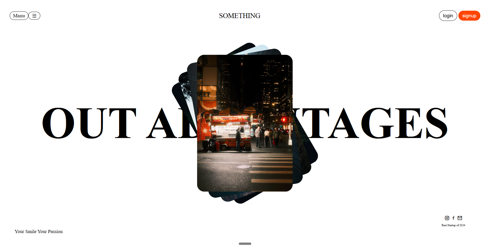

# Frontend Designs

A collection of frontend designs built while practicing layout, typography, and visual interaction. Each design has its own folder with the page source and a preview image.

## Designs

### 1. First Design

A clean landing page concept with a centered image composition, oversized typography, and a simple navigation bar.

- Page: [Open the first design](first/index.html)
- Source: [HTML](first/index.html) | [CSS](first/style.css)
- Preview:

More frontend designs will be added here as they are created.
